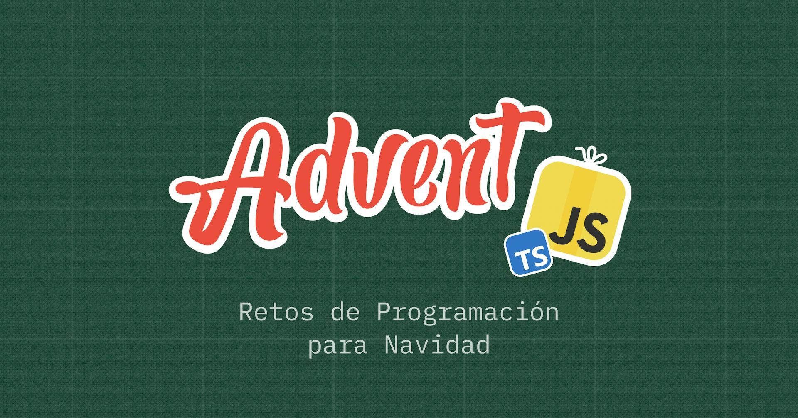

# AdventJS by [@midudev][midudev]
This repository is a collection of solutions and resolutions for the AdventJS challenges from various editions

![JavaScript][javascript-badge]
![Jest][jest-badge]
![ESLint][eslint-badge]

## 📦 Requirements
- [NodeJS][nodejs-link] _v24.11.1_
- [PNPM][pnpm-link] _v10.24.0_

## 📅 Editions

  
  
  
  
  

## 🧞 Commands
| Command                                   | Action                                             |
| :---------------------------------------- | :------------------------------------------------- |
| `pnpm install`                            | Installs dependencies                              |
| `pnpm test`                               | Runs all tests in the project                      |
| `pnpm test editions/$YEAR`                | Runs tests for a specific edition **$YEAR**        |
| `pnpm test editions/$YEAR/challenges/$ID` | Runs a specific test for a given challenge **$ID** |

[github-profile]: https://github.com/maurodviveros
[midudev]: https://midu.dev
[nodejs-link]: https://nodejs.org/
[pnpm-link]: https://pnpm.io/
[javascript-badge]: https://img.shields.io/badge/javascript-%23323330.svg?style=for-the-badge&logo=javascript&logoColor=%23F7DF1E
[jest-badge]: https://img.shields.io/badge/-jest-%23C21325?style=for-the-badge&logo=jest&logoColor=white
[eslint-badge]: https://img.shields.io/badge/ESLint-4B3263?style=for-the-badge&logo=eslint&logoColor=white
