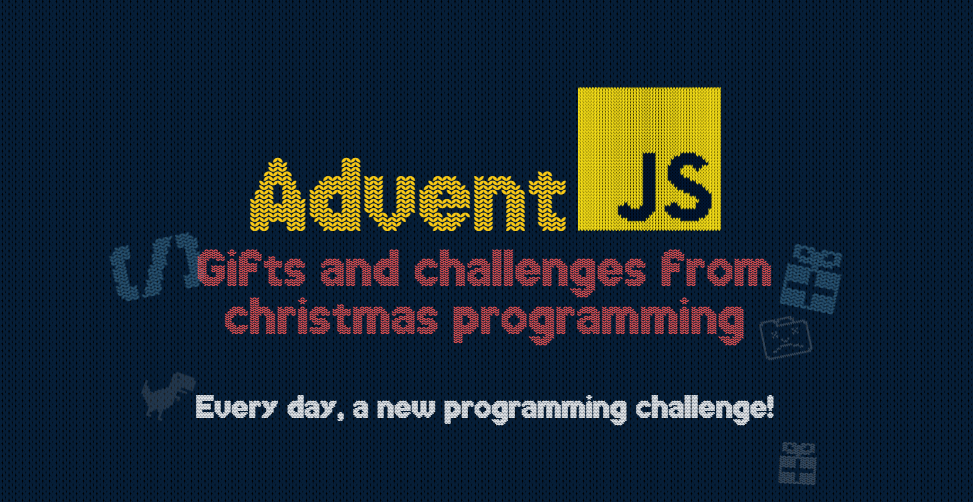

# AdventJS by [@midudev][midudev]
This repository is a collection of solutions and resolutions for the AdventJS challenges from various editions

![JavaScript][javascript-badge]
![Jest][jest-badge]
![ESLint][eslint-badge]

## 📦 Requeriments
- [NodeJS][nodejs-link] _v20.9.0_

## 📅 Editions

| Logo                                               | Year                               | Solutions                          |
| :------------------------------------------------: | :--------------------------------: | :--------------------------------: |
|  | [2021](https://2021.adventjs.dev/) | [Show solutions](./editions/2021/) |
|  | [2022](https://2022.adventjs.dev/) | [Show solutions](./editions/2022/) |
|  | [2023](https://2023.adventjs.dev/) | [Show solutions](./editions/2023/) |

[github-profile]: https://github.com/maurodviveros
[midudev]: https://midu.dev
[nodejs-link]: https://nodejs.org
[javascript-badge]: https://img.shields.io/badge/javascript-%23323330.svg?style=for-the-badge&logo=javascript&logoColor=%23F7DF1E
[jest-badge]: https://img.shields.io/badge/-jest-%23C21325?style=for-the-badge&logo=jest&logoColor=white
[eslint-badge]: https://img.shields.io/badge/ESLint-4B3263?style=for-the-badge&logo=eslint&logoColor=white
